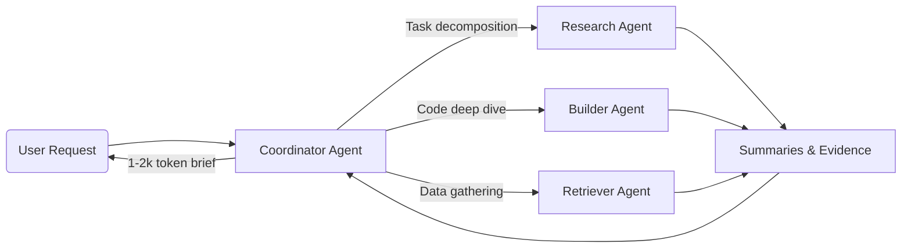

# Context Engineering for Agents

> "Context engineering is the delicate art and science of filling the context window with just the right information for the next step." — Andrej Karpathy

## The Problem

LLMs have an **attention budget**. Every token depletes it.

- O(n²) attention pairs → longer context = thinner, noisier attention
- ChromaDB study: 11/12 models dropped below 50% performance at 32K tokens
- Microsoft study: accuracy fell from 90% → 51% in longer conversations

**More context ≠ better outcomes.** After a threshold, performance degrades (context rot).

```
Performance (%)
100 |\
 90 | \
 80 |  \
 70 |   \
 60 |    \
 50 |     \__ context rot begins
 40 |        \______
     +-----------------→ Context Length (tokens)
       4K     16K     32K+
```

## Why Context Fails

The parallel to human cognition is striking. When humans face information overload, the dorsolateral prefrontal cortex "gives up" - decision quality deteriorates. But humans have **anxiety as a warning signal**. LLMs have no such mechanism - they silently degrade without self-awareness.

Research reveals counterintuitive findings:

- **Distractors**: Even ONE irrelevant element reduces performance
- **Structure Paradox**: Logically organized contexts can perform _worse_ than shuffled ones
- **Position Effects**: Information at start/end is retrieved better than middle

The implication: careful curation beats comprehensive context every time.

## Types of Agent Memory

Not all memory is equal:

| Type           | What it stores       | Example                                | Limitation                           |
| -------------- | -------------------- | -------------------------------------- | ------------------------------------ |
| **Semantic**   | Facts about things   | "Python uses indentation"              | Doesn't teach _how_                  |
| **Episodic**   | Events that happened | "Build failed at 3pm"                  | Context-specific, doesn't generalize |
| **Procedural** | How to do things     | "Always check schema before migration" | Transfers across tasks               |

RAG gives you semantic memory. Chat history gives you episodic memory. The challenge is building **procedural memory** - patterns of _how to succeed_ that transfer to new situations.

## Approaches to Context Management

### Static Context

What most teams start with:

- `CLAUDE.md` / `CURSOR_RULES` files with project rules
- Examples folders
- Manual PRPs (Product Requirements Prompts)

**Trade-offs:**

- ✅ Simple to implement
- ✅ Predictable behavior
- ❌ Goes stale fast
- ❌ Manual maintenance overhead
- ❌ Token bloat (loads everything every time)

### Long-Horizon Techniques

For tasks that exceed the context window:

**Compaction**

- Summarize history → restart with high-fidelity summary
- Keep architectural decisions, discard redundant tool outputs
- Best for: conversational tasks with extensive back-and-forth

**Structured Note-Taking**

- Agent writes persistent notes outside context (e.g., `NOTES.md`)
- Pull back into context as needed
- Best for: iterative development with clear milestones

**Sub-Agent Architectures**

- Coordinator plans; specialized sub-agents do deep dives
- Return condensed summaries (≈1-2k tokens)
- Best for: complex research where parallel exploration pays off



### Dynamic Context / Learning Systems

Systems where context evolves through execution:

- Reflect on what worked/failed
- Curate strategies into persistent memory
- Inject learned patterns on future runs

This addresses the maintenance problem of static context - the system learns instead of requiring manual updates.

## Key Principles

### 1. Smallest Possible High-Signal Tokens

Good context engineering = finding the minimum tokens that maximize desired outcome.

Techniques:

- Compression formats (reduce token overhead)
- Citation-based tracking (reference, don't repeat)
- Active pruning (remove what doesn't help)

### 2. Just-In-Time Context

Don't preload everything. Fetch what's needed during execution.

- Keep lightweight references (file paths, queries)
- Load data at runtime using tools
- Mirrors human cognition: we don't memorize databases, we know how to look things up

### 3. Right Altitude

System prompts should be clear but not over-specified:

- Too specific → fragility, high maintenance
- Too vague → bad output, false assumptions

Find the level of abstraction that guides without constraining.

### 4. Tool Design

Fewer, well-scoped tools beat many overlapping ones. If a human can't pick the right tool from your set, the model won't either.

---

## ACE: One Implementation

ACE (Agentic Context Engineering) is an open-source implementation of dynamic context learning based on [Stanford research](https://arxiv.org/abs/2510.04618).

```
Execute task → Reflect on outcome → Curate strategies → Inject on next run
```

It focuses on **procedural memory** - learning _how to do things_ rather than storing facts.

**Results on browser automation:**

- 30% → 100% success rate
- 82% fewer steps
- 65% token cost reduction

```bash
pip install agentic-context-engine
```

GitHub: [kayba-ai/agentic-context-engine](https://github.com/kayba-ai/agentic-context-engine)

---

## Resources

- [Anthropic: Effective Context Engineering](https://www.anthropic.com/engineering/context-engineering)
- [Stanford ACE Paper](https://arxiv.org/abs/2510.04618)
- [ChromaDB Context Length Research](https://research.trychroma.com/context-length)
